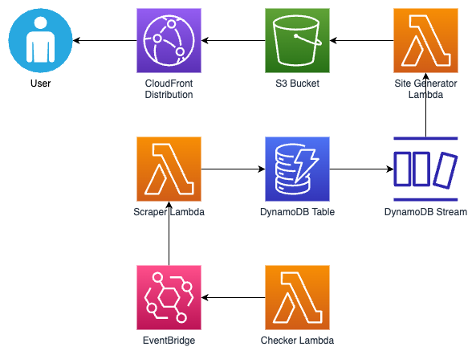

# NFL Fun Index - Serverless

A website that scrapes data from sources and rates past NFL games on how fun they were to watch.

Ideally I would host this at `nfl.lgrv.net` as a subdomain of my personal domain, but I use Cloudflare for DNS which
does not play nicely with AWS CloudFront at all, so the site is only viewable
at [d1m1ehvj01f3jr.cloudfront.net](https://d1m1ehvj01f3jr.cloudfront.net/) rather than a pretty URL.

This was previously a Flask app deployed on a VPS with Docker and Nginx, but I have recently rewritten it to use
serverless, event-driven microservices on AWS, all defined as infrastructure-as-code, with automated, reproducible
builds.

### How the build works

- Running `make deploy` triggers the build and deploy process
- AWS Lambda functions are written in Python using the AWS Chalice framework, with a simple FastAPI-like decorator
  interface
- Chalice has a little-known function that can emit Terraform `.tf.json` files defining the Lambdas as AWS resources and
  all the accompanying policies, roles, event rules and targets, etc
- This Terraform json is combined with typical Terraform HCL configuring additional resources that Chalice isn't able
  to, like DynamoDB and S3

### How the app works

- A Lambda runs every 2 hours checking the source for new games that don't have data in the DynamoDB table
- If it finds games that require scraping, it will put them in an event on the default AWS EventBridge event bus
- Another Lambda is listening to the event bus and will scrape the game(s) into the DynamoDB table
- The DynamoDB table has streams enabled and will send events whenever the table changes
- A third Lambda is list

### Installation

#### Prerequisites:

- Python 3.9
- Terraform
- Poetry, the Python package manager
- An AWS account configured in your ~/.aws directory
- GNU Make

#### Process:

* Clone this repository
* `cd` into the root directory
* Run `make deploy` to run the build and deploy process

### Built with

- Python 3.9
- AWS Chalice & boto3
- Lambda for compute
- DynamoDB for persistence
- S3 for static web page storage and hosting
- BeautifulSoup and Selenium for scraping
- Pandas for turning HTML into dataframes
- Jinja2 for HTML templating

### License

This project is licensed under the MIT License - see the LICENSE.md file for details
